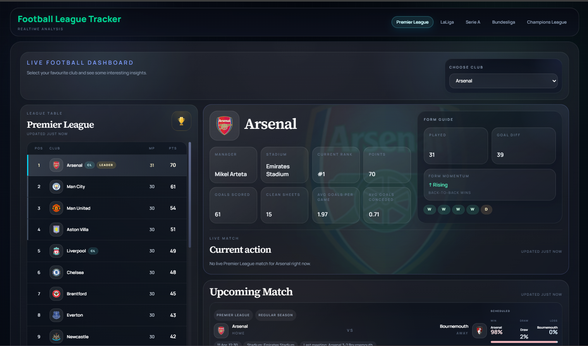
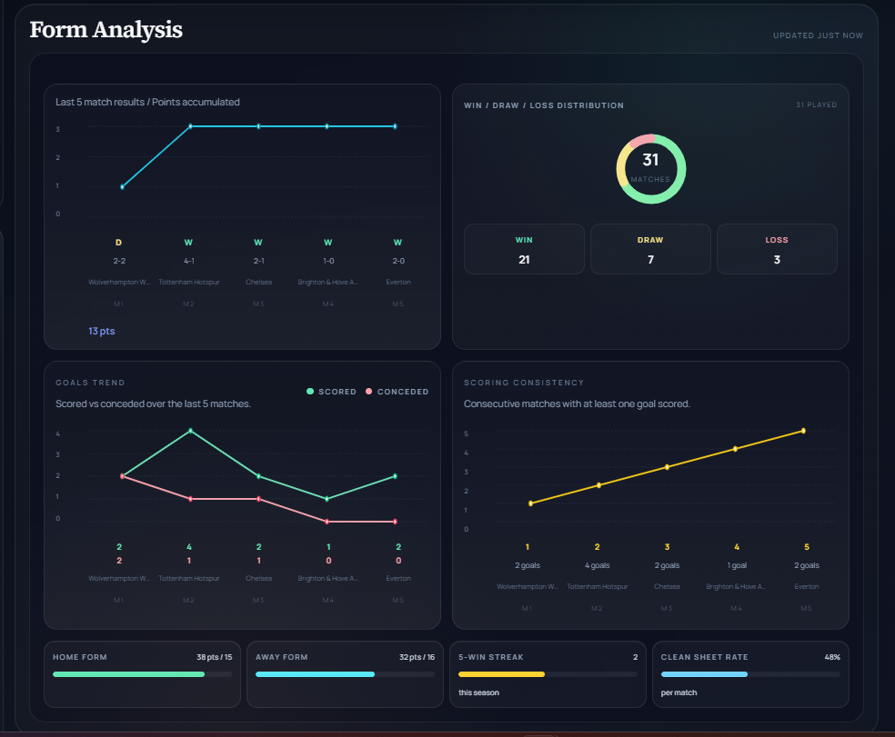
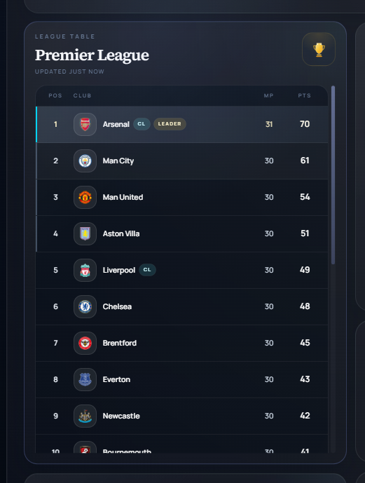

# Football League Tracker

Football League Tracker is a product-style football analytics dashboard built to help fans explore club performance across multiple competitions in one place.

It combines league tables, form analysis, live match context, club insights, scorer leaderboards, and upcoming fixtures into a polished dashboard experience.

## Product Overview

Football League Tracker lets a user choose a club and instantly understand:

- where the club sits in the table
- current points, rank, goals scored, and clean sheets
- recent form and momentum
- last match result and next upcoming fixture
- top scorers in the competition
- clubs with the most goals
- clubs with the most clean sheets
- recent league winners
- competition-specific context such as Champions League progression

## Supported Competitions

- Premier League
- LaLiga
- Serie A
- Bundesliga
- Champions League

## Key Features

- Multi-league dashboard experience with a product-style UI
- Live standings and club-level metrics
- Current action and live match context
- Last match result with quick access to YouTube highlights
- Form analysis with:
  - points trend
  - goals scored vs conceded trend
  - scoring consistency
  - win / draw / loss distribution
  - home and away form
  - clean sheet rate
- League-wide panels for:
  - current top scorers
  - most goals
  - most clean sheets
  - recent winners
- Club-specific upcoming cup and European competition tracking where data is available

## Screenshots

This repository includes actual product screenshots for portfolio presentation.

### Main Dashboard



### Form Analysis



### League Table



### Top Scorers


## Product Positioning

This project is designed as a portfolio-ready football product concept rather than a basic stats viewer.

It focuses on:

- clean presentation
- data hierarchy
- football-specific insight panels
- multi-competition browsing
- polished dashboard interactions

## Tech Stack

- JavaScript
- React
- JSX
- Tailwind CSS
- Vite

## Data Source

The live data layer is powered primarily by [football-data.org](https://www.football-data.org/documentation/api).

The app uses that API for:

- competition standings
- team fixtures and match history
- team details
- top scorers
- competition match feeds

Some cup fixtures currently use manual fallbacks where the active API plan does not provide reliable domestic cup coverage.

## Local Development

1. Install dependencies

```powershell
npm.cmd install
```

2. Create a local environment file:

```powershell
FOOTBALL_DATA_API_KEY=your_football_data_api_key_here
```

Save it in:

```powershell
.env.local
```

3. Start the app

```powershell
npm.cmd run dev -- --host 127.0.0.1 --port 4174
```

4. Open:

[http://127.0.0.1:4174](http://127.0.0.1:4174)

## Netlify Deployment

For Netlify, add this environment variable:

```powershell
FOOTBALL_DATA_API_KEY=your_football_data_api_key_here
```

This project includes:

- [netlify.toml](/C:/Users/omkes/Downloads/Leauge%20football%20details/netlify.toml)
- [netlify/functions/football-data.js](/C:/Users/omkes/Downloads/Leauge%20football%20details/netlify/functions/football-data.js)

Without that variable, the deployed app will show fallback messages instead of live data.

## Project Structure

- [src/App.jsx](/C:/Users/omkes/Downloads/Leauge%20football%20details/src/App.jsx) - main UI and dashboard logic
- [src/lib/footballApi.js](/C:/Users/omkes/Downloads/Leauge%20football%20details/src/lib/footballApi.js) - API integration and caching
- [src/data/teams.js](/C:/Users/omkes/Downloads/Leauge%20football%20details/src/data/teams.js) - local club metadata
- [src/index.css](/C:/Users/omkes/Downloads/Leauge%20football%20details/src/index.css) - global styling and theme system
- [vite.config.js](/C:/Users/omkes/Downloads/Leauge%20football%20details/vite.config.js) - Vite config

## Notes

- `.env.local` is ignored by git and should never be committed
- some recent-winner data is maintained manually
- some domestic cup fixtures currently use verified public-source fallbacks
- live API coverage depends on your football-data.org plan

## Roadmap

- stronger production data reliability for domestic cup competitions
- richer event-level match data such as scorers and goal timestamps
- historical season analysis
- deeper player-level analytics
- improved mobile-specific layout refinements
- additional portfolio screenshots and product branding assets

## Why This Repo Exists

This repository presents Football League Tracker as a football analytics product concept suitable for:

- portfolio presentation
- frontend product showcase
- continued feature expansion
- deployment on platforms like Netlify
